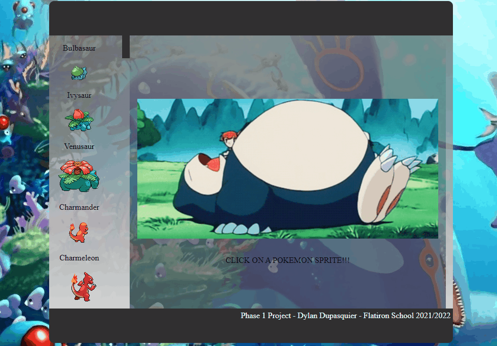

## Overview

This **PokeDex** app was created for my phase 1 project for Flatiron School. It is a vanilla JS and CSS application, designed to allow the user to read about the first 151 Pokemon.

## Demo

[Live](https://pokedex-fi.herokuapp.com/)
## Tech Stack

Vanilla JavaScript 
HTML5 
CSS

## Setup

Simply open the [index.html](./index.html) file in your browser